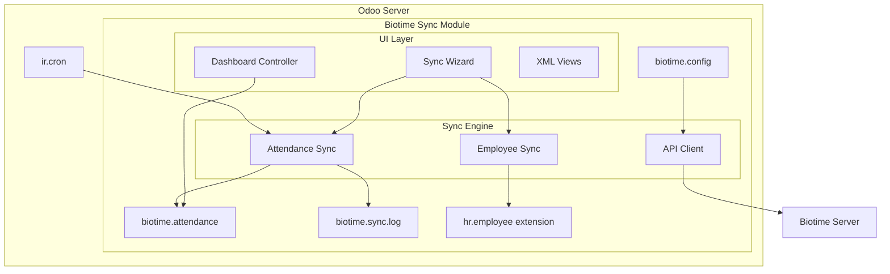
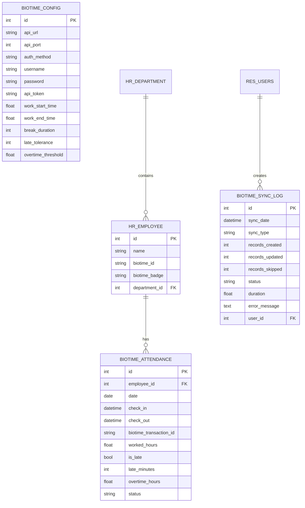
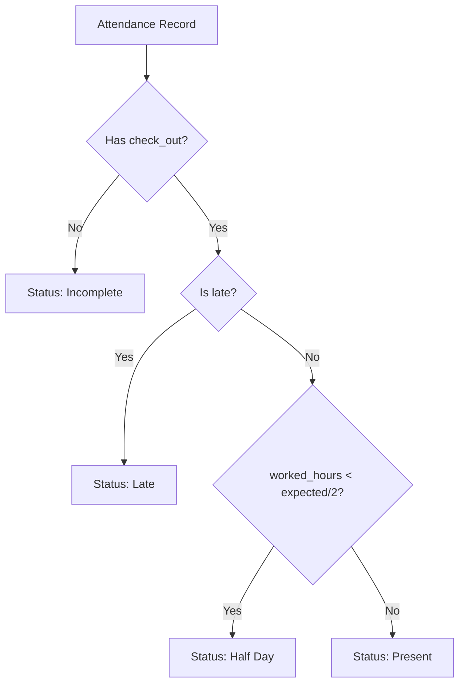

# Design Document: Biotime Sync

## Overview

Biotime Sync is an Odoo 19 module that integrates with ZKTeco Biotime biometric systems to synchronize employee attendance data. The module follows Odoo's standard architecture patterns using models, views, controllers, wizards, and security configurations.

The design prioritizes:
- Clean separation between API communication and business logic
- Configurable business rules for attendance calculations
- Comprehensive logging for troubleshooting
- Role-based access control
- Real-time dashboard with interactive charts

## Architecture



## Components and Interfaces

### 1. Configuration Model (biotime.config)

Singleton model storing API connection settings and business rules.

```python
class BiotimeConfig(models.Model):
    _name = 'biotime.config'
    _description = 'Biotime Configuration'
    
    # API Settings
    api_url: str                    # Base URL of Biotime server
    api_port: int                   # Port number (default: 443)
    auth_method: Selection          # 'token', 'jwt', 'basic'
    username: str                   # For JWT/Basic auth
    password: str                   # For JWT/Basic auth
    api_token: str                  # For Token auth
    
    # Business Rules
    work_start_time: float          # Expected arrival (hours, e.g., 9.0)
    work_end_time: float            # Expected departure (hours, e.g., 18.0)
    break_duration: int             # Break minutes (default: 60)
    late_tolerance: int             # Grace period minutes (default: 15)
    overtime_threshold: float       # Daily hours before OT (default: 8.0)
    
    # Methods
    def test_connection() -> bool
    def get_api_client() -> BiotimeAPIClient
    def action_sync_now() -> wizard
```

### 2. API Client

Internal class handling all Biotime API communication.

```python
class BiotimeAPIClient:
    def __init__(config: BiotimeConfig)
    
    # Authentication
    def authenticate() -> str           # Returns token/session
    def _get_headers() -> dict          # Auth headers for requests
    
    # API Endpoints
    def fetch_employees() -> List[dict]
    def fetch_transactions(start_time: datetime, end_time: datetime) -> List[dict]
    
    # Pagination handling
    def _fetch_paginated(endpoint: str, params: dict) -> List[dict]
```

### 3. Attendance Model (biotime.attendance)

Stores synchronized attendance records with calculated fields.

```python
class BiotimeAttendance(models.Model):
    _name = 'biotime.attendance'
    _description = 'Biotime Attendance'
    
    # Core Fields
    employee_id: Many2one('hr.employee')
    date: Date
    check_in: Datetime
    check_out: Datetime
    biotime_transaction_id: str     # External reference
    
    # Calculated Fields (computed)
    worked_hours: float             # check_out - check_in - break
    is_late: bool                   # check_in > work_start + tolerance
    late_minutes: int               # Minutes late
    overtime_hours: float           # worked_hours - threshold
    status: Selection               # present/absent/late/leave/half_day/incomplete
    
    # Computation Methods
    @api.depends('check_in', 'check_out')
    def _compute_worked_hours()
    
    @api.depends('check_in')
    def _compute_late_status()
    
    @api.depends('worked_hours')
    def _compute_overtime()
    
    @api.depends('check_in', 'check_out', 'is_late', 'worked_hours')
    def _compute_status()
```

### 4. Employee Extension (hr.employee)

Extends the standard employee model with Biotime mapping.

```python
class HrEmployee(models.Model):
    _inherit = 'hr.employee'
    
    biotime_id: str                 # Biotime employee ID
    biotime_badge: str              # Badge/barcode number
```

### 5. Sync Log Model (biotime.sync.log)

Tracks synchronization operations for auditing and troubleshooting.

```python
class BiotimeSyncLog(models.Model):
    _name = 'biotime.sync.log'
    _description = 'Biotime Sync Log'
    
    sync_date: Datetime
    sync_type: Selection            # 'employees', 'attendance', 'full'
    records_created: int
    records_updated: int
    records_skipped: int
    status: Selection               # 'success', 'error', 'partial'
    duration: float                 # Seconds
    error_message: Text
    user_id: Many2one('res.users')
```

### 6. Sync Wizard (biotime.sync.wizard)

Transient model for manual sync operations.

```python
class BiotimeSyncWizard(models.TransientModel):
    _name = 'biotime.sync.wizard'
    
    sync_type: Selection            # 'employees', 'attendance', 'full'
    date_from: Date
    date_to: Date
    
    def action_sync() -> dict       # Execute sync, return result action
```

### 7. Dashboard Controller

HTTP controller providing dashboard data via JSON endpoints.

```python
class BiotimeDashboardController(http.Controller):
    
    @http.route('/biotime/dashboard/stats', type='json', auth='user')
    def get_stats(department_id: int, date_from: str, date_to: str) -> dict
    
    @http.route('/biotime/dashboard/trend', type='json', auth='user')
    def get_trend(department_id: int, days: int) -> List[dict]
    
    @http.route('/biotime/dashboard/department_hours', type='json', auth='user')
    def get_department_hours(date_from: str, date_to: str) -> List[dict]
    
    @http.route('/biotime/dashboard/status_distribution', type='json', auth='user')
    def get_status_distribution(department_id: int, date: str) -> dict
    
    @http.route('/biotime/dashboard/top_late', type='json', auth='user')
    def get_top_late(limit: int) -> List[dict]
```

## Data Models

### Entity Relationship Diagram



### Biotime API Response Mappings

**Employee Endpoint Response:**
```json
{
  "id": 123,
  "emp_code": "EMP001",
  "first_name": "John",
  "last_name": "Doe",
  "department": {"id": 1, "name": "IT"}
}
```

**Transaction Endpoint Response:**
```json
{
  "id": 456,
  "emp_code": "EMP001",
  "punch_time": "2024-01-15 09:05:23",
  "punch_state": "0"
}
```

### Status Determination Logic



## Correctness Properties

*A property is a characteristic or behavior that should hold true across all valid executions of a system—essentially, a formal statement about what the system should do. Properties serve as the bridge between human-readable specifications and machine-verifiable correctness guarantees.*


### Property 1: Employee Matching Priority

*For any* Biotime employee record and set of Odoo employees, the matching algorithm SHALL first attempt to match by biotime_id, and only if no match is found, attempt to match by barcode field.

**Validates: Requirements 2.2**

### Property 2: Pagination Completeness

*For any* paginated API response with N total pages, the sync engine SHALL fetch exactly N pages and return all records from all pages combined.

**Validates: Requirements 3.2**

### Property 3: Transaction Chronological Pairing

*For any* set of transactions for the same employee on the same day, the sync engine SHALL pair them as check-in/check-out in chronological order, where the earliest unpaired transaction becomes check-in and the next becomes check-out.

**Validates: Requirements 3.4**

### Property 4: Worked Hours Calculation

*For any* attendance record with valid check-in time C_in, check-out time C_out, and break duration B (in hours), the worked_hours SHALL equal (C_out - C_in) - B, and SHALL be zero when check-out is missing.

**Validates: Requirements 5.1, 5.2, 5.3**

### Property 5: Late Detection

*For any* attendance record with check-in time C_in, work start time W_start, and late tolerance T (in minutes):
- is_late SHALL be true if and only if C_in > W_start + T
- late_minutes SHALL equal max(0, (C_in - W_start) in minutes)

**Validates: Requirements 6.1, 6.2, 6.3**

### Property 6: Overtime Calculation

*For any* attendance record with worked_hours W and overtime_threshold T, the overtime_hours SHALL equal max(0, W - T).

**Validates: Requirements 7.1, 7.2**

### Property 7: Status Determination

*For any* attendance record, the status SHALL be determined as follows:
- "incomplete" if check_out is missing
- "late" if is_late is true and check_out exists
- "half_day" if worked_hours < (expected_daily_hours / 2) and not late
- "present" if check_in and check_out exist, not late, and worked_hours >= half day threshold

**Validates: Requirements 8.2, 8.3, 8.4, 8.5**

### Property 8: Dashboard Department Hours Aggregation

*For any* date range and set of attendance records, the department hours aggregation SHALL return the sum of worked_hours grouped by department, where each department's total equals the sum of all its employees' worked_hours in the period.

**Validates: Requirements 10.3**

### Property 9: Dashboard Status Distribution

*For any* date and set of attendance records, the status distribution SHALL return counts for each status value where the sum of all counts equals the total number of records for that date.

**Validates: Requirements 10.4**

### Property 10: Top Late Employees Ranking

*For any* set of attendance records over a week, the top late employees list SHALL be ordered by late_count descending, where late_count is the number of records with is_late=true for each employee.

**Validates: Requirements 10.5**

### Property 11: Dashboard Filter Application

*For any* department filter D and date range [start, end], all dashboard statistics SHALL only include attendance records where employee.department_id = D (if D specified) AND date is within [start, end].

**Validates: Requirements 11.3**

### Property 12: Security-Based Record Visibility

*For any* user U accessing attendance records:
- If U is in User group: visible records SHALL only include records where employee_id.user_id = U
- If U is in Supervisor group: visible records SHALL only include records where employee_id.department_id = U.employee_id.department_id
- If U is in Manager group: all records SHALL be visible

**Validates: Requirements 13.2, 13.3, 13.4**

## Error Handling

### API Communication Errors

| Error Type | Handling Strategy |
|------------|-------------------|
| Connection timeout | Retry up to 3 times with exponential backoff, then log error and abort |
| Authentication failure | Log error with details, display user-friendly message, abort sync |
| Rate limiting (429) | Wait for retry-after header duration, then retry |
| Server error (5xx) | Retry up to 3 times, then log and abort |
| Invalid response format | Log raw response, skip record, continue with next |

### Data Validation Errors

| Error Type | Handling Strategy |
|------------|-------------------|
| Missing employee mapping | Skip transaction, log warning with employee code |
| Invalid datetime format | Attempt common format parsing, skip if all fail |
| Duplicate transaction ID | Update existing record instead of creating new |
| Missing required fields | Skip record, log warning |

### Sync Operation Errors

```python
try:
    # Sync operation
    result = sync_attendance(date_from, date_to)
except ConnectionError as e:
    log.create({'status': 'error', 'error_message': f'Connection failed: {e}'})
except AuthenticationError as e:
    log.create({'status': 'error', 'error_message': f'Auth failed: {e}'})
except Exception as e:
    log.create({'status': 'error', 'error_message': f'Unexpected error: {e}'})
    raise  # Re-raise for Odoo error handling
```

## Testing Strategy

### Unit Tests

Unit tests verify specific examples and edge cases:

1. **Configuration Tests**
   - Test default values are set correctly
   - Test auth method field visibility logic
   - Test connection test with mocked responses

2. **Calculation Tests**
   - Test worked_hours with various check-in/check-out combinations
   - Test late detection at boundary conditions (exactly at tolerance)
   - Test overtime at threshold boundary
   - Test status determination for each status type

3. **Sync Logic Tests**
   - Test employee matching with biotime_id match
   - Test employee matching fallback to barcode
   - Test transaction pairing with even/odd transaction counts
   - Test handling of unmapped employees

4. **Dashboard Tests**
   - Test statistics calculation with known data
   - Test filter application

### Property-Based Tests

Property-based tests verify universal properties across generated inputs using the `hypothesis` library for Python:

**Configuration:**
- Minimum 100 iterations per property test
- Each test tagged with: `Feature: biotime-sync, Property N: [property_text]`

**Test Structure:**
```python
from hypothesis import given, strategies as st

@given(
    check_in=st.datetimes(),
    check_out=st.datetimes(),
    break_minutes=st.integers(min_value=0, max_value=120)
)
def test_worked_hours_calculation(check_in, check_out, break_minutes):
    """Feature: biotime-sync, Property 4: Worked Hours Calculation"""
    # Assume check_out > check_in
    assume(check_out > check_in)
    
    record = create_attendance(check_in, check_out, break_minutes)
    expected = (check_out - check_in).total_seconds() / 3600 - (break_minutes / 60)
    
    assert abs(record.worked_hours - expected) < 0.001
```

**Properties to Test:**
1. Property 4: Worked hours calculation
2. Property 5: Late detection
3. Property 6: Overtime calculation
4. Property 7: Status determination
5. Property 8: Department hours aggregation
6. Property 9: Status distribution
7. Property 10: Top late ranking
8. Property 11: Filter application

### Integration Tests

1. **Full Sync Flow**
   - Test employee sync followed by attendance sync
   - Verify sync log creation

2. **Cron Execution**
   - Test scheduled sync triggers correctly
   - Verify date range is current day

3. **Security Rules**
   - Test record visibility for each user group
   - Test configuration access restrictions
